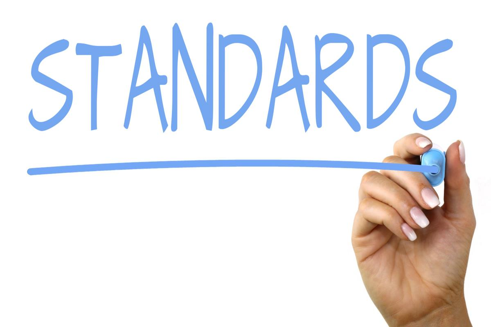
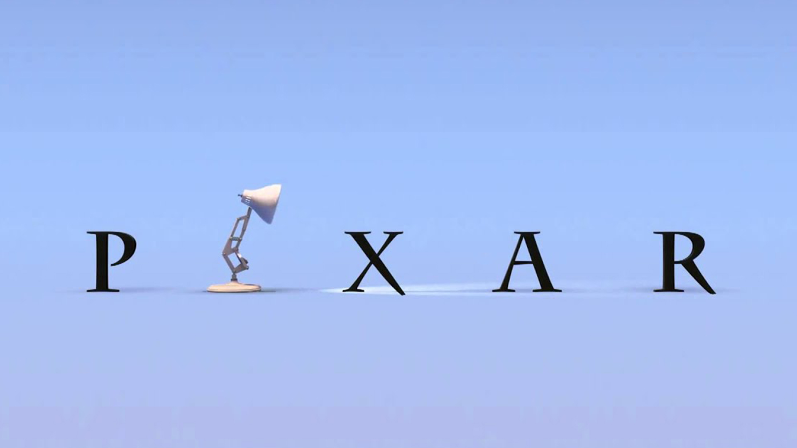
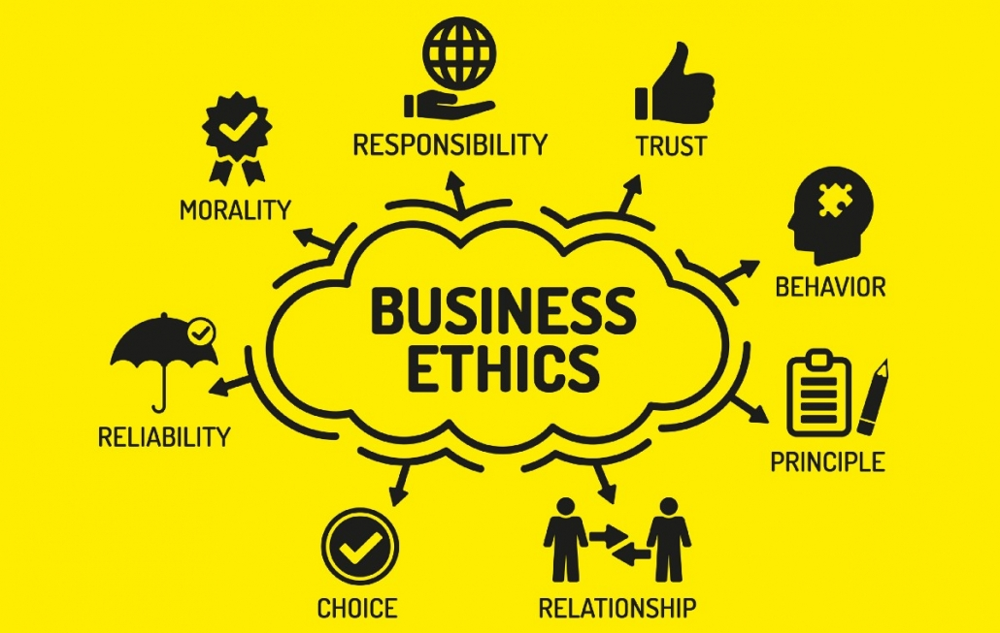
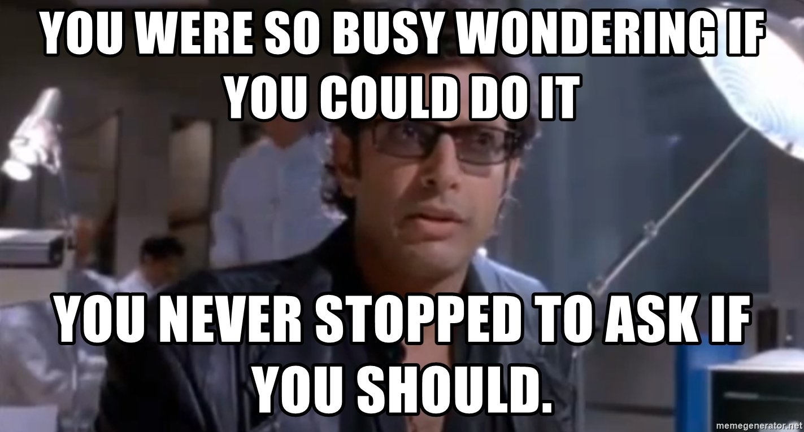

## End of One Journey

Throughout this semester of web design and creating a website in a team environment, I've learned a few things about the fundamentals in software engineering. I'm not going to lie and I understand everything from my experience in class. However, there are some fundamentals that stood out to me during my time in class. Some of the fundamentals that stuck with me are coding standards, design patterns, and ethics in software engineering. 

### Coding Standards: the Golden Standard
  

Coding standards like any other standards set the bar for software engineers to follow to ensure code written for websites, programs, etc. are clean and understandable. And I learned that not all coding standards are the same in each company. Companies will have similar coding standards as there would be the fundamental groundwork for coding in general. But each company will have their own standards to coding.  

  

Whether or not I end up in an industry that uses coding, I think coding standards can be applied to just about any industry. An example of this can be applied to the animation industry. each animation industry have different standards of animation. You can compare Pixar and Kyoto animation since they have vastly different animations styles so they have different standards to have follow. That's why the animation quality of these companies are high quality even with different styles. I would adapt to these different standards regardless of industry so I can make sure the product being delivered is up to standard.  

## Design Patterns: Styles and Strategies for Success  

Design patterns was something that was hard for me to understand at first. However, I was able to understand it through comparing it to video game strategies. If you want to learn more about my experience with my comparison with design patterns and video games check out [here](https://ltonglee3104.github.io/essays/Design-Patterns.html).  
  
But overall, design patterns is essentially different set ways to write code so certain problems can be solved. One example is for web design that updates user information, you would want to have a reactive design pattern for it. Another example is designing a website that users can log in for banking. A front controller pattern design can help with controlling who is able to access their proper accounts.  

I can apply these design patterns in the future whether or not I stay in the industry because I can take those concepts and apply it to different jobs. Knowing certain design patterns are similar to real life scenarios, I can apply it to almost everything. If I get into the animation industry, I can apply some design patterns like the observer pattern to the animation pipeline. It isn't a direct one-to-one translation but I can take feedback from other animators to improve my animation and then deliver a better product to the audience.  
  
### Ethics: Right and Wrong
  

Though ethics is applied everywhere, it's interesting to see how in software engineering that it is a more sensitive topic. Ethics in software engineering can mean the protection of humanity or the selling of humanity's information for profit. When working in the field of software engineering, we have the power to advance humanity for the greater good but also take advantage of technology for greed and profit.  

We have advanced so much in technology and with software engineering, we can create almost everything but we sometimes overlook how we do it and if it's even ethical.  

  

No matter where I go, ethics is an important thing that I have to keep in mind when I develop/create something for the world. I would have to consider that wherever I work since I can't work for a place that goes against my ethical opinions. 

## Conclusion and to the Future

I've learned a decent amount of lessons throughout this semester and I really enjoyed (and suffered a little) learning in this class. Some of the things I learned from this class can really be applied to other jobs and I feel like I can use it effectively in the next chapter of my life.

