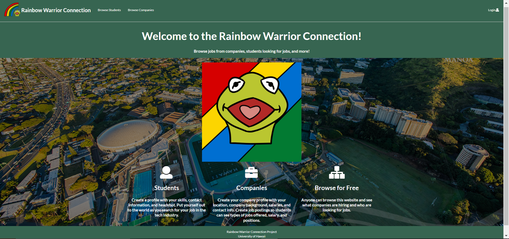
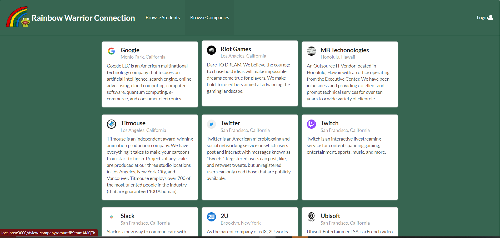
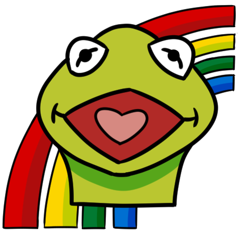

The Rainbow Warrior Connection is a group web project assigned to Bret Witt, Anthony Lau, Jericho Macabante. The website we created is supposed to help connect students and companies together. This will help students find jobs as they graduate from UH Manoa and companies find applicable candidates for their companies. Students should be able to browse companies and see what jobs are open. Companies on the other hand can browse students and create job postings. You can see our project at [Rainbow Warrior Connection](https://rainbowwarriorconnection.github.io/).

### Landing Page
  

My role in this project was to work on the design for the admin page, landing page, logo, adding the default data for certain parts of the backend, updating the project's webpage, researching current jobs/companies, and trying to clean up the front end.  

Since this is my first group project when it comes to coding, communication was key in order to try get things done. We used issue driven project management for us to try and get the project done. It was a useful way to manage out project but we encountered some problems.  

### Browsing Companies

We all had our strengths and weaknesses. Bret was really good with mongoDB so he implemented the collections we needed. I'm not the best at doing those things but with my animation background, I came up with the logos and different variations of it so the website can be updated. 

### One Logo Variant

I was able to do the logo fairly quickly and have a decent landing page on top of that. However, I couldn't figure out the issue of a white border around it. I was also doing a lot of current research for companies, where they are located, and job postings so we can add it to default collections. I ran into difficulties when setting up the admin powers for the website and it was only partially implemented. In the end, we couldn't implement everything and parts of the webpage are a little broken. 

The project was a challenging assignment with communicating with group members to get certain issues completed as some of them are needed for other issues. I got to learn that I like working on the front end of web design as I like to make websites look more attractive to the user.  

