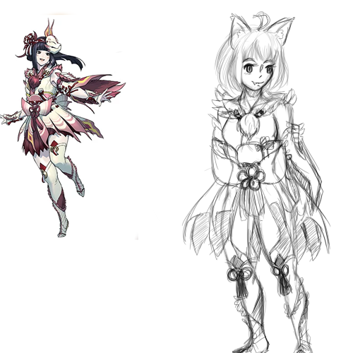

The Big Hunt was one of my first major animation projects where I had to tell a story of my choosing. It was an independent project
that really put my animation skills and story telling skills to the test. I had to change my story to fit my time limit and 
not be overly ambitious. This project taught me how to manage time as well as the animation people. 

One of the main things about this project is that sound design was important. I spent a few days recording audio and finding free
foley sounds online before I could even start animating. After completing that, I planned out what scenes I would animate first and
which to animate last. I also learned tips on animation like cycles and holding frames for effect so I could complete this animation on time. 

If you would like to see this animation visit this link to my drive. [The Big Hunt](https://drive.google.com/file/d/1YX2OlIwxSB639diVJZMZ_fb0wWQZszz8/view?usp=sharing)
