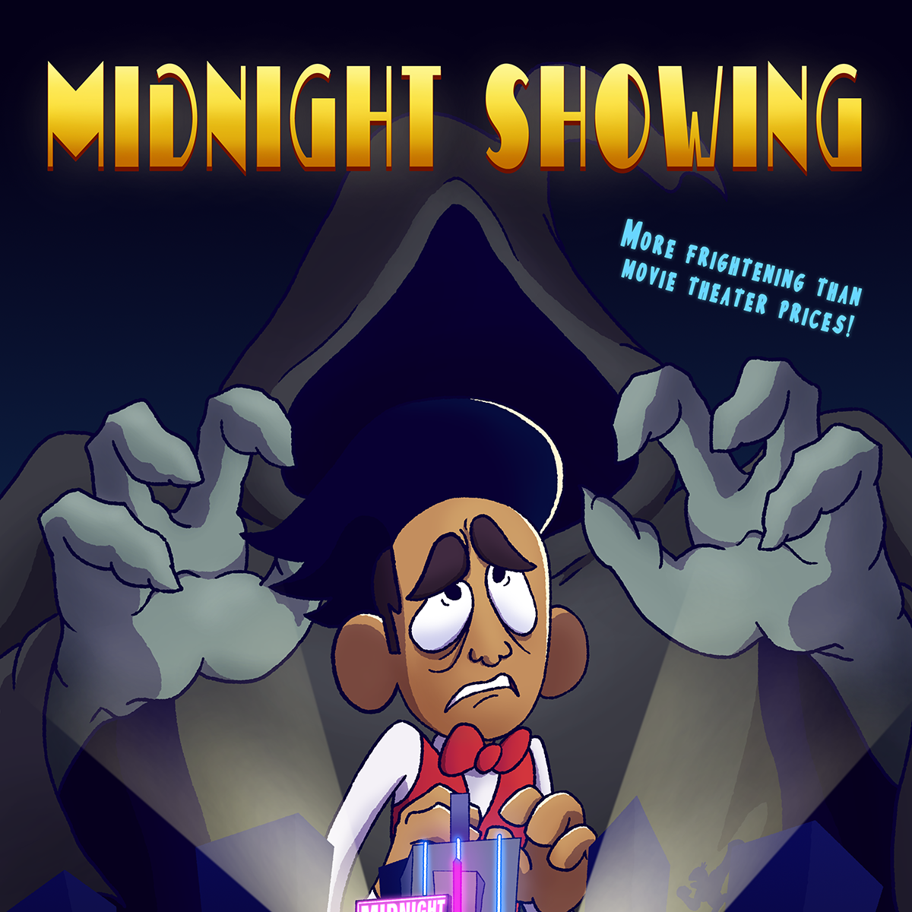

Midnight Showing is a film directed and produced by Gavin Arucan. This film is about a movie worker (Angel) working the late shift at his job as he soon
finds out the creepy nature of the movie theatre. This project was a capstone project that I assisted in the production of the film. This film was presented at
Hawaii International Film Festival 2020 and won awards.

On this project, I was invited to help with coloring the scenes for the final parts of the production. I was given many scenes and set color palletes so I can keep the 
animations consistant with all the other animators and colorists. We were working in a computer lab so I was able to get input on final colors by the director so I delievered
my shots to the final project of the animation. Overall, I was able to be a part of a large team of animators communicating with one another on how to get the final film 
completed. 

When working on this project, I learned the ways on how to expedite teh production process as I was given set colors and instructions on how to color and shade the shot.
It was really fun working with other animators and figure out a rhythm when working. At the end of the production, I was able to enjoy working and communitcating with my fellow animators. 

