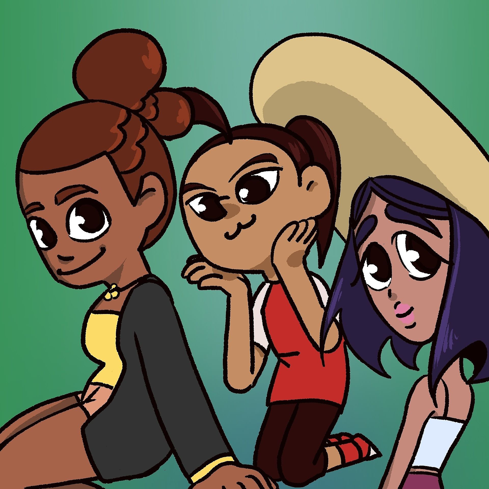

Pua Warriors was a cartoon directed and produced by Sophia Whalen. The film was written by Sophia Whalen and Gavin Arucan. This cartoon project
is to entertain viewers and teach them the importance of keeping the island of Hawaii clean from pollution. The cartoon also teaches the viewers
about the beautiful flowers of our island. 

On this project, I was invited to help do rough animation and clean up animation during production. I took on shots that were for the beginning of the
cartoon. Given a schedule, I worked on shots like the plate lunch and some of the action scenes. The vast majority of the project I was in communication with the
director and producer on where to clean up and fix shots, similar to what a real animation company would do. 

After finishing my shots, I took on extra shots to help keep the production going and even did final coloring before post fx. We ended up finishing 
the project ahead of schedule and was able to polish up on shots before my director turned it in for their final assignment. After completion of the cartoon, 
it was presented at the Hawaii International Film Festival and other film festivals before winning awards at the Academy of Creative Media Awards Festival. 

You can view this cartoon here at the NMG Network. [Pua Warriors](https://nmgnetwork.com/watch/pua-warriors/)

